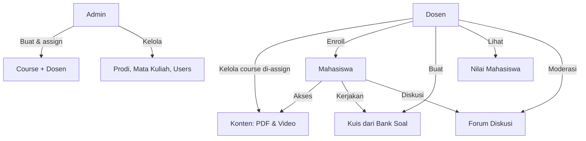
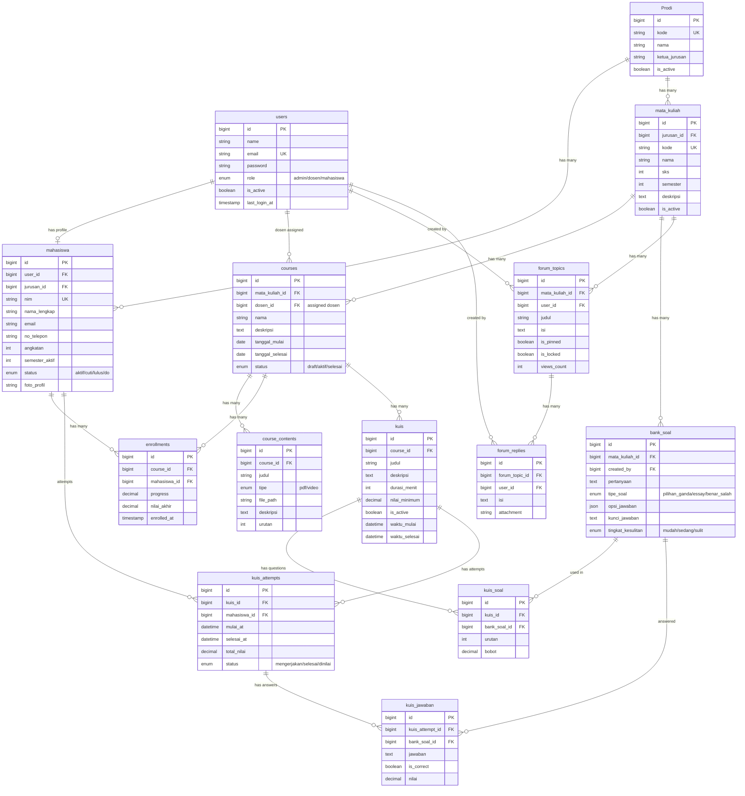

# Implementation Plan — Sistem E-Learning Politeknik APP Jakarta (Updated)

## Background

Berdasarkan PRD dan feedback user, sistem e-learning ini memiliki **3 panel terpisah**:
- **Admin** (`/admin`) — Menyiapkan data master (Prodi, mata kuliah, user), membuat course, dan meng-assign dosen
- **Dosen** (`/dosen`) — Mengelola course yang di-assign, enroll mahasiswa, kelola konten & bank soal, buat kuis, lihat nilai, moderasi forum
- **Mahasiswa** (`/mahasiswa`) — Mengikuti course, akses materi, mengerjakan kuis, forum diskusi

### Tech Stack
- **Laravel 12** + **Filament v5** + **PostgreSQL** + **Livewire 4**

---

## Arsitektur & Alur Kerja

---

## Skema Database (ERD)

---

## Phase 1 — Migrations & Models
> Lihat file migration yang sudah dibuat di `database/migrations/`

## Phase 2 — Admin Panel Resources
- JurusanResource, MataKuliahResource, UserResource, CourseResource (create + assign dosen)

## Phase 3 — Dosen Panel
- Dashboard: daftar course yang di-assign
- Kelola konten course (upload PDF/video)
- Kelola bank soal per mata kuliah
- Buat & kelola kuis (pilih soal dari bank soal)
- Enroll mahasiswa ke course
- Lihat nilai & progress mahasiswa
- Moderasi forum diskusi

## Phase 4 — Mahasiswa Panel
- Dashboard: daftar course enrolled
- Akses materi (download PDF, putar video)
- Kerjakan kuis (timer, submit jawaban, lihat hasil)
- Forum diskusi (buat topik, reply)

## Phase 5 — Dashboard Widgets & Seeder

---
