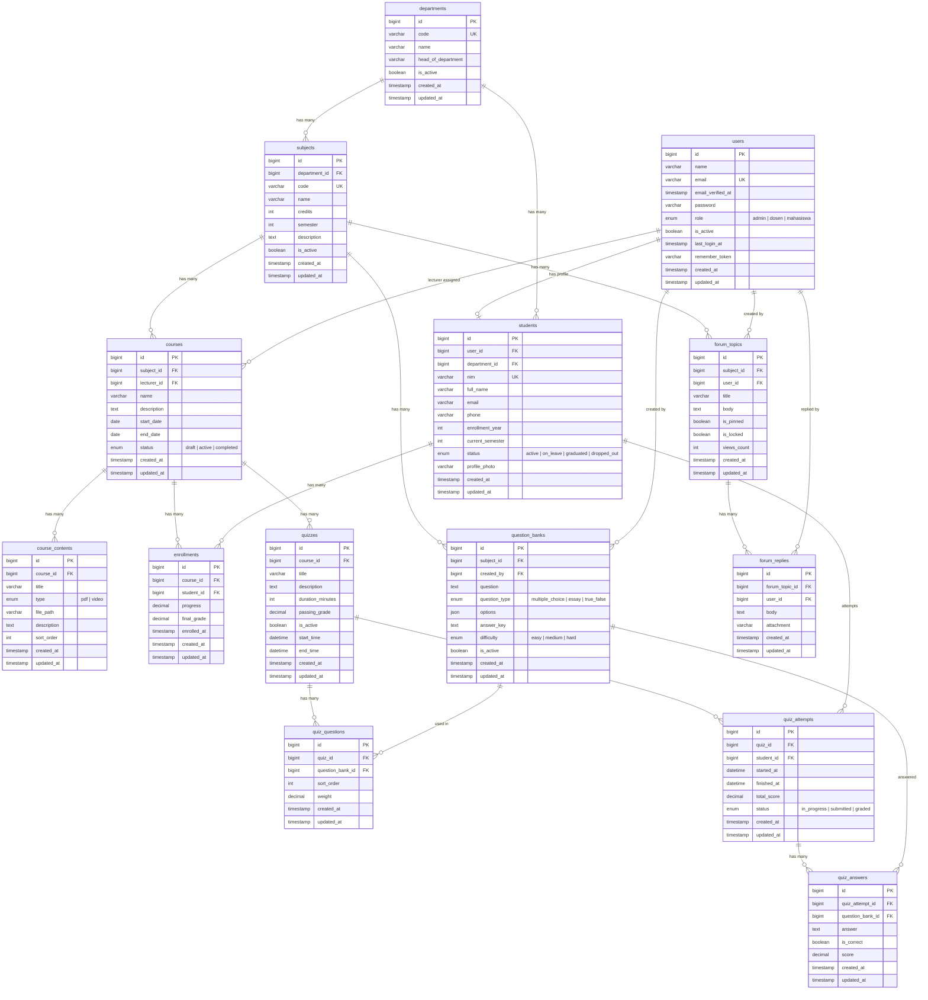

# Database Migration — Sistem E-Learning Politeknik APP Jakarta

> **Project:** E-Learning Politeknik APP Jakarta
> **Database:** PostgreSQL
> **Framework:** Laravel 12 + Filament v5
> **Tanggal:** 16 Juli 2026

---

## Entity Relationship Diagram (ERD)



---

## Pemetaan Konsep

| Konsep (Bahasa Indonesia) | Nama Tabel (English) | Keterangan |
|---------------------------|---------------------|------------|
| Prodi | `departments` | Program studi / Prodi |
| Mahasiswa | `students` | Data profil mahasiswa |
| Mata Kuliah | `subjects` | Mata kuliah per Prodi |
| Course | `courses` | Kelas e-learning (di-assign ke dosen) |
| Konten Course | `course_contents` | Modul PDF & Video |
| Enrollment | `enrollments` | Pendaftaran mahasiswa ke course |
| Bank Soal | `question_banks` | Kumpulan soal per mata kuliah |
| Kuis | `quizzes` | Ujian/kuis per course |
| Soal Kuis | `quiz_questions` | Pivot: soal yang ada di kuis |
| Percobaan Kuis | `quiz_attempts` | Percobaan pengerjaan kuis |
| Jawaban Kuis | `quiz_answers` | Jawaban per soal per percobaan |
| Topik Forum | `forum_topics` | Topik diskusi per mata kuliah |
| Balasan Forum | `forum_replies` | Balasan pada topik diskusi |

---

## Daftar Migration Files

| # | File Migration | Tabel | Deskripsi |
|---|---------------|-------|-----------|
| 1 | [create_users_table.php](file:///v:/laragon/laragon/www/sil/database/migrations/0001_01_01_000000_create_users_table.php) | `users`, `password_reset_tokens`, `sessions` | Tabel user inti + autentikasi + sesi |
| 2 | [create_cache_table.php](file:///v:/laragon/laragon/www/sil/database/migrations/0001_01_01_000001_create_cache_table.php) | `cache`, `cache_locks` | Cache framework Laravel |
| 3 | [create_jobs_table.php](file:///v:/laragon/laragon/www/sil/database/migrations/0001_01_01_000002_create_jobs_table.php) | `jobs`, `job_batches`, `failed_jobs` | Queue jobs framework Laravel |
| 4 | [create_departments_table.php](file:///v:/laragon/laragon/www/sil/database/migrations/2026_07_16_000001_create_departments_table.php) | `departments` | Data Prodi |
| 5 | [create_students_table.php](file:///v:/laragon/laragon/www/sil/database/migrations/2026_07_16_000002_create_students_table.php) | `students` | Data mahasiswa |
| 6 | [create_subjects_table.php](file:///v:/laragon/laragon/www/sil/database/migrations/2026_07_16_000003_create_subjects_table.php) | `subjects` | Data mata kuliah |
| 7 | [create_courses_table.php](file:///v:/laragon/laragon/www/sil/database/migrations/2026_07_16_000004_create_courses_table.php) | `courses` | Course e-learning |
| 8 | [create_course_contents_table.php](file:///v:/laragon/laragon/www/sil/database/migrations/2026_07_16_000005_create_course_contents_table.php) | `course_contents` | Konten modul & video |
| 9 | [create_enrollments_table.php](file:///v:/laragon/laragon/www/sil/database/migrations/2026_07_16_000006_create_enrollments_table.php) | `enrollments` | Enrollment mahasiswa |
| 10 | [create_question_banks_table.php](file:///v:/laragon/laragon/www/sil/database/migrations/2026_07_16_000007_create_question_banks_table.php) | `question_banks` | Bank soal |
| 11 | [create_quizzes_table.php](file:///v:/laragon/laragon/www/sil/database/migrations/2026_07_16_000008_create_quizzes_table.php) | `quizzes` | Kuis |
| 12 | [create_quiz_questions_table.php](file:///v:/laragon/laragon/www/sil/database/migrations/2026_07_16_000009_create_quiz_questions_table.php) | `quiz_questions` | Pivot soal dalam kuis |
| 13 | [create_quiz_attempts_table.php](file:///v:/laragon/laragon/www/sil/database/migrations/2026_07_16_000010_create_quiz_attempts_table.php) | `quiz_attempts` | Percobaan kuis |
| 14 | [create_quiz_answers_table.php](file:///v:/laragon/laragon/www/sil/database/migrations/2026_07_16_000011_create_quiz_answers_table.php) | `quiz_answers` | Jawaban kuis |
| 15 | [create_forum_topics_table.php](file:///v:/laragon/laragon/www/sil/database/migrations/2026_07_16_000012_create_forum_topics_table.php) | `forum_topics` | Topik forum |
| 16 | [create_forum_replies_table.php](file:///v:/laragon/laragon/www/sil/database/migrations/2026_07_16_000013_create_forum_replies_table.php) | `forum_replies` | Balasan forum |

---

## Detail Tabel

### 1. `users`
> Tabel utama untuk semua pengguna sistem (admin, dosen, mahasiswa).

| Kolom | Tipe | Constraint | Keterangan |
|-------|------|-----------|------------|
| `id` | bigint | PK, AUTO_INCREMENT | Primary key |
| `name` | varchar(255) | NOT NULL | Nama lengkap pengguna |
| `email` | varchar(255) | NOT NULL, UNIQUE | Email untuk login |
| `email_verified_at` | timestamp | NULLABLE | Waktu verifikasi email |
| `password` | varchar(255) | NOT NULL | Password (hashed) |
| `role` | enum | NOT NULL, DEFAULT 'admin' | Role: `admin`, `dosen`, `mahasiswa` |
| `is_active` | boolean | NOT NULL, DEFAULT true | Status aktif akun |
| `last_login_at` | timestamp | NULLABLE | Waktu login terakhir |
| `remember_token` | varchar(100) | NULLABLE | Token "remember me" |
| `created_at` | timestamp | NULLABLE | — |
| `updated_at` | timestamp | NULLABLE | — |

---

### 2. `departments`
> Data Prodi / program studi.

| Kolom | Tipe | Constraint | Keterangan |
|-------|------|-----------|------------|
| `id` | bigint | PK, AUTO_INCREMENT | Primary key |
| `code` | varchar(255) | NOT NULL, UNIQUE | Kode Prodi (misal: TI, MI) |
| `name` | varchar(255) | NOT NULL | Nama Prodi |
| `head_of_department` | varchar(255) | NULLABLE | Nama ketua Prodi |
| `is_active` | boolean | NOT NULL, DEFAULT true | Status aktif |
| `created_at` | timestamp | NULLABLE | — |
| `updated_at` | timestamp | NULLABLE | — |

---

### 3. `students`
> Profil mahasiswa, terhubung ke `users` dan `departments`.

| Kolom | Tipe | Constraint | Keterangan |
|-------|------|-----------|------------|
| `id` | bigint | PK, AUTO_INCREMENT | Primary key |
| `user_id` | bigint | FK → `users.id`, CASCADE DELETE | Akun user terkait |
| `department_id` | bigint | FK → `departments.id`, RESTRICT DELETE | Prodi |
| `nim` | varchar(255) | NOT NULL, UNIQUE | Nomor Induk Mahasiswa |
| `full_name` | varchar(255) | NOT NULL | Nama lengkap |
| `email` | varchar(255) | NULLABLE | Email mahasiswa |
| `phone` | varchar(255) | NULLABLE | Nomor telepon |
| `enrollment_year` | int | NOT NULL | Tahun masuk / angkatan |
| `current_semester` | int | NOT NULL, DEFAULT 1 | Semester aktif |
| `status` | enum | NOT NULL, DEFAULT 'active' | `active`, `on_leave`, `graduated`, `dropped_out` |
| `profile_photo` | varchar(255) | NULLABLE | Path foto profil |
| `created_at` | timestamp | NULLABLE | — |
| `updated_at` | timestamp | NULLABLE | — |

---

### 4. `subjects`
> Data mata kuliah, terhubung ke `departments`.

| Kolom | Tipe | Constraint | Keterangan |
|-------|------|-----------|------------|
| `id` | bigint | PK, AUTO_INCREMENT | Primary key |
| `department_id` | bigint | FK → `departments.id`, RESTRICT DELETE | Prodi pemilik MK |
| `code` | varchar(255) | NOT NULL, UNIQUE | Kode mata kuliah |
| `name` | varchar(255) | NOT NULL | Nama mata kuliah |
| `credits` | int | NOT NULL, DEFAULT 2 | Jumlah SKS |
| `semester` | int | NOT NULL | Semester |
| `description` | text | NULLABLE | Deskripsi mata kuliah |
| `is_active` | boolean | NOT NULL, DEFAULT true | Status aktif |
| `created_at` | timestamp | NULLABLE | — |
| `updated_at` | timestamp | NULLABLE | — |

---

### 5. `courses`
> Course e-learning. Dibuat oleh admin, di-assign ke dosen via `lecturer_id`.

| Kolom | Tipe | Constraint | Keterangan |
|-------|------|-----------|------------|
| `id` | bigint | PK, AUTO_INCREMENT | Primary key |
| `subject_id` | bigint | FK → `subjects.id`, RESTRICT DELETE | Mata kuliah terkait |
| `lecturer_id` | bigint | FK → `users.id`, RESTRICT DELETE | Dosen yang di-assign |
| `name` | varchar(255) | NOT NULL | Nama course |
| `description` | text | NULLABLE | Deskripsi course |
| `start_date` | date | NULLABLE | Tanggal mulai |
| `end_date` | date | NULLABLE | Tanggal selesai |
| `status` | enum | NOT NULL, DEFAULT 'draft' | `draft`, `active`, `completed` |
| `created_at` | timestamp | NULLABLE | — |
| `updated_at` | timestamp | NULLABLE | — |

---

### 6. `course_contents`
> Konten pembelajaran (modul PDF untuk download, video untuk streaming).

| Kolom | Tipe | Constraint | Keterangan |
|-------|------|-----------|------------|
| `id` | bigint | PK, AUTO_INCREMENT | Primary key |
| `course_id` | bigint | FK → `courses.id`, CASCADE DELETE | Course pemilik |
| `title` | varchar(255) | NOT NULL | Judul konten |
| `type` | enum | NOT NULL | `pdf` atau `video` |
| `file_path` | varchar(255) | NOT NULL | Path file di storage |
| `description` | text | NULLABLE | Deskripsi konten |
| `sort_order` | int | NOT NULL, DEFAULT 0 | Urutan tampil |
| `created_at` | timestamp | NULLABLE | — |
| `updated_at` | timestamp | NULLABLE | — |

---

### 7. `enrollments`
> Pendaftaran mahasiswa ke course. Dosen yang enroll mahasiswa.

| Kolom | Tipe | Constraint | Keterangan |
|-------|------|-----------|------------|
| `id` | bigint | PK, AUTO_INCREMENT | Primary key |
| `course_id` | bigint | FK → `courses.id`, CASCADE DELETE | Course |
| `student_id` | bigint | FK → `students.id`, CASCADE DELETE | Mahasiswa |
| `progress` | decimal(5,2) | NOT NULL, DEFAULT 0 | Progress (0.00 - 100.00) |
| `final_grade` | decimal(5,2) | NULLABLE | Nilai akhir |
| `enrolled_at` | timestamp | NOT NULL, DEFAULT CURRENT | Waktu enrollment |
| `created_at` | timestamp | NULLABLE | — |
| `updated_at` | timestamp | NULLABLE | — |

> **UNIQUE constraint:** `(course_id, student_id)` — satu mahasiswa hanya bisa enroll satu kali per course.

---

### 8. `question_banks`
> Bank soal per mata kuliah. Dibuat oleh dosen.

| Kolom | Tipe | Constraint | Keterangan |
|-------|------|-----------|------------|
| `id` | bigint | PK, AUTO_INCREMENT | Primary key |
| `subject_id` | bigint | FK → `subjects.id`, RESTRICT DELETE | Mata kuliah |
| `created_by` | bigint | FK → `users.id`, RESTRICT DELETE | Pembuat soal (dosen) |
| `question` | text | NOT NULL | Teks pertanyaan |
| `question_type` | enum | NOT NULL | `multiple_choice`, `essay`, `true_false` |
| `options` | json | NULLABLE | Opsi jawaban (untuk pilihan ganda) |
| `answer_key` | text | NOT NULL | Kunci jawaban |
| `difficulty` | enum | NOT NULL, DEFAULT 'medium' | `easy`, `medium`, `hard` |
| `is_active` | boolean | NOT NULL, DEFAULT true | Status aktif |
| `created_at` | timestamp | NULLABLE | — |
| `updated_at` | timestamp | NULLABLE | — |

> **Format `options` (JSON):**
> ```json
> ["Pilihan A", "Pilihan B", "Pilihan C", "Pilihan D"]
> ```

---

### 9. `quizzes`
> Kuis / ujian yang dibuat oleh dosen dalam sebuah course.

| Kolom | Tipe | Constraint | Keterangan |
|-------|------|-----------|------------|
| `id` | bigint | PK, AUTO_INCREMENT | Primary key |
| `course_id` | bigint | FK → `courses.id`, CASCADE DELETE | Course terkait |
| `title` | varchar(255) | NOT NULL | Judul kuis |
| `description` | text | NULLABLE | Deskripsi / instruksi kuis |
| `duration_minutes` | int | NOT NULL, DEFAULT 60 | Durasi pengerjaan (menit) |
| `passing_grade` | decimal(5,2) | NOT NULL, DEFAULT 60.00 | Nilai minimum kelulusan |
| `is_active` | boolean | NOT NULL, DEFAULT false | Kuis aktif / tidak |
| `start_time` | datetime | NULLABLE | Waktu mulai tersedia |
| `end_time` | datetime | NULLABLE | Waktu berakhir |
| `created_at` | timestamp | NULLABLE | — |
| `updated_at` | timestamp | NULLABLE | — |

---

### 10. `quiz_questions`
> Pivot tabel: soal-soal yang dimasukkan ke dalam kuis (dari bank soal).

| Kolom | Tipe | Constraint | Keterangan |
|-------|------|-----------|------------|
| `id` | bigint | PK, AUTO_INCREMENT | Primary key |
| `quiz_id` | bigint | FK → `quizzes.id`, CASCADE DELETE | Kuis |
| `question_bank_id` | bigint | FK → `question_banks.id`, RESTRICT DELETE | Soal dari bank soal |
| `sort_order` | int | NOT NULL, DEFAULT 0 | Urutan soal |
| `weight` | decimal(5,2) | NOT NULL, DEFAULT 1.00 | Bobot nilai soal |
| `created_at` | timestamp | NULLABLE | — |
| `updated_at` | timestamp | NULLABLE | — |

> **UNIQUE constraint:** `(quiz_id, question_bank_id)` — satu soal tidak bisa muncul dua kali dalam satu kuis.

---

### 11. `quiz_attempts`
> Percobaan pengerjaan kuis oleh mahasiswa.

| Kolom | Tipe | Constraint | Keterangan |
|-------|------|-----------|------------|
| `id` | bigint | PK, AUTO_INCREMENT | Primary key |
| `quiz_id` | bigint | FK → `quizzes.id`, CASCADE DELETE | Kuis |
| `student_id` | bigint | FK → `students.id`, CASCADE DELETE | Mahasiswa |
| `started_at` | datetime | NOT NULL | Waktu mulai mengerjakan |
| `finished_at` | datetime | NULLABLE | Waktu selesai |
| `total_score` | decimal(5,2) | NULLABLE | Total nilai |
| `status` | enum | NOT NULL, DEFAULT 'in_progress' | `in_progress`, `submitted`, `graded` |
| `created_at` | timestamp | NULLABLE | — |
| `updated_at` | timestamp | NULLABLE | — |

---

### 12. `quiz_answers`
> Jawaban individual per soal per percobaan kuis.

| Kolom | Tipe | Constraint | Keterangan |
|-------|------|-----------|------------|
| `id` | bigint | PK, AUTO_INCREMENT | Primary key |
| `quiz_attempt_id` | bigint | FK → `quiz_attempts.id`, CASCADE DELETE | Percobaan kuis |
| `question_bank_id` | bigint | FK → `question_banks.id`, RESTRICT DELETE | Soal yang dijawab |
| `answer` | text | NULLABLE | Jawaban mahasiswa |
| `is_correct` | boolean | NULLABLE | Benar / salah (null = belum dinilai) |
| `score` | decimal(5,2) | NULLABLE | Nilai per soal |
| `created_at` | timestamp | NULLABLE | — |
| `updated_at` | timestamp | NULLABLE | — |

> **UNIQUE constraint:** `(quiz_attempt_id, question_bank_id)` — satu soal hanya dijawab satu kali per attempt.

---

### 13. `forum_topics`
> Topik diskusi per mata kuliah.

| Kolom | Tipe | Constraint | Keterangan |
|-------|------|-----------|------------|
| `id` | bigint | PK, AUTO_INCREMENT | Primary key |
| `subject_id` | bigint | FK → `subjects.id`, CASCADE DELETE | Mata kuliah |
| `user_id` | bigint | FK → `users.id`, CASCADE DELETE | Pembuat topik |
| `title` | varchar(500) | NOT NULL | Judul topik (maks 500 karakter) |
| `body` | text | NOT NULL | Isi topik |
| `is_pinned` | boolean | NOT NULL, DEFAULT false | Disematkan oleh dosen |
| `is_locked` | boolean | NOT NULL, DEFAULT false | Dikunci (tidak bisa dibalas) |
| `views_count` | int | NOT NULL, DEFAULT 0 | Jumlah views |
| `created_at` | timestamp | NULLABLE | — |
| `updated_at` | timestamp | NULLABLE | — |

---

### 14. `forum_replies`
> Balasan pada topik diskusi.

| Kolom | Tipe | Constraint | Keterangan |
|-------|------|-----------|------------|
| `id` | bigint | PK, AUTO_INCREMENT | Primary key |
| `forum_topic_id` | bigint | FK → `forum_topics.id`, CASCADE DELETE | Topik yang dibalas |
| `user_id` | bigint | FK → `users.id`, CASCADE DELETE | Penulis balasan |
| `body` | text | NOT NULL | Isi balasan |
| `attachment` | varchar(255) | NULLABLE | Path file lampiran |
| `created_at` | timestamp | NULLABLE | — |
| `updated_at` | timestamp | NULLABLE | — |

---

## Ringkasan Foreign Keys

| Tabel Asal | Kolom FK | Referensi | On Delete |
|-----------|----------|-----------|-----------|
| `students` | `user_id` | `users.id` | CASCADE |
| `students` | `department_id` | `departments.id` | RESTRICT |
| `subjects` | `department_id` | `departments.id` | RESTRICT |
| `courses` | `subject_id` | `subjects.id` | RESTRICT |
| `courses` | `lecturer_id` | `users.id` | RESTRICT |
| `course_contents` | `course_id` | `courses.id` | CASCADE |
| `enrollments` | `course_id` | `courses.id` | CASCADE |
| `enrollments` | `student_id` | `students.id` | CASCADE |
| `question_banks` | `subject_id` | `subjects.id` | RESTRICT |
| `question_banks` | `created_by` | `users.id` | RESTRICT |
| `quizzes` | `course_id` | `courses.id` | CASCADE |
| `quiz_questions` | `quiz_id` | `quizzes.id` | CASCADE |
| `quiz_questions` | `question_bank_id` | `question_banks.id` | RESTRICT |
| `quiz_attempts` | `quiz_id` | `quizzes.id` | CASCADE |
| `quiz_attempts` | `student_id` | `students.id` | CASCADE |
| `quiz_answers` | `quiz_attempt_id` | `quiz_attempts.id` | CASCADE |
| `quiz_answers` | `question_bank_id` | `question_banks.id` | RESTRICT |
| `forum_topics` | `subject_id` | `subjects.id` | CASCADE |
| `forum_topics` | `user_id` | `users.id` | CASCADE |
| `forum_replies` | `forum_topic_id` | `forum_topics.id` | CASCADE |
| `forum_replies` | `user_id` | `users.id` | CASCADE |

---

## Ringkasan Unique Constraints

| Tabel | Kolom / Kombinasi | Tipe |
|-------|-------------------|------|
| `users` | `email` | Single column |
| `departments` | `code` | Single column |
| `students` | `nim` | Single column |
| `subjects` | `code` | Single column |
| `enrollments` | `(course_id, student_id)` | Composite |
| `quiz_questions` | `(quiz_id, question_bank_id)` | Composite |
| `quiz_answers` | `(quiz_attempt_id, question_bank_id)` | Composite |

---
